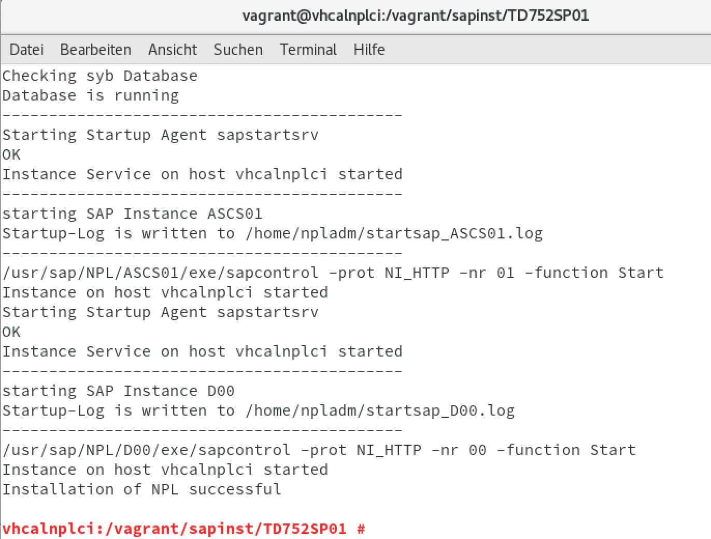
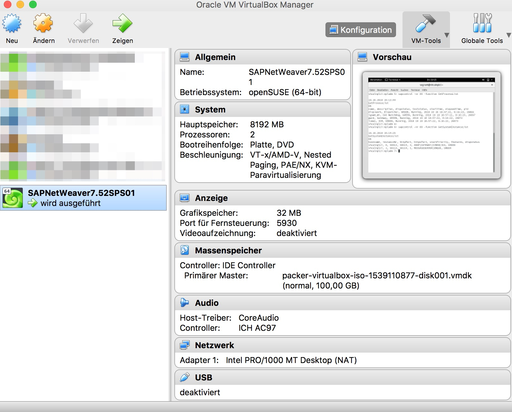
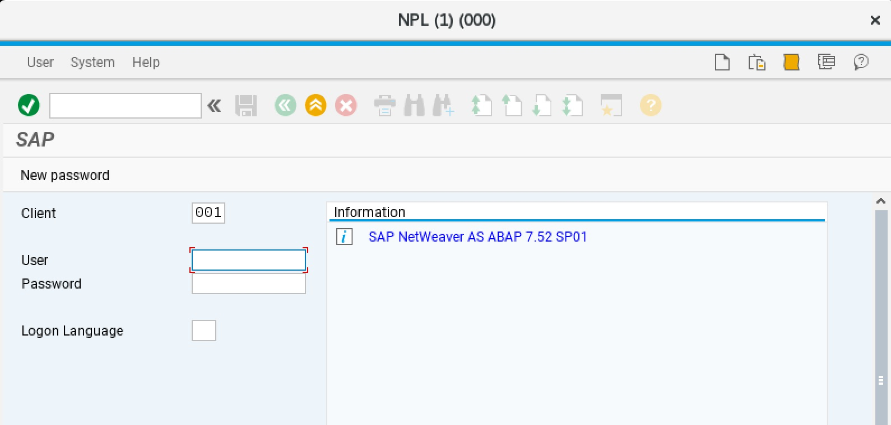

## Please take a look at the new project SAPNW752SP04
The openSUSE Leap 15.1 Vagrant box prepared to install SAP NetWeaver AS ABAP 752 SP04 Developer Edition
 [wechris/SAPNW752SP04](https://github.com/wechris/SAPNW752SP04)


Introduction
============
The openSUSE Leap 42.3 Vagrant box can be used to create a VirtualBox instance with Vagrant to install [SAP NW AS ABAP 752 SP01 Developer Edition](https://blogs.sap.com/2018/09/13/as-abap-752-sp01-developer-edition-to-download/#comment-437359) .
 
 All recommended system preparations are done by packer and vagrant, as described at [Installing ABAP AS on Oracle VirtualBox](https://blogs.sap.com/2018/09/13/as-abap-752-sp01-developer-edition-to-download/) without the proxy part.

 The pre-built Vagrant Box is now avaiable on HashiCorps Vagrant Cloud:

 https://app.vagrantup.com/wechris

 The Packer calls are no longer necessary. If you want to create your own Vagrant Box with Packer see the optional section below.

 The step D.1. ***sudo -i*** and ***FINALLY, we run the installation, by entering the command ./install.sh*** must be done manually!
 
Prerequisites
=============
 
On OS X VirtualBox and Vagrant, is available via [Homebrew](http://brew.sh/) on Windows via [Chocolatey](https://chocolatey.org).

OS X: 
```
$ brew install virtualbox
$ brew install vagrant
```
optional:
```
$ brew install vagrant-manager
```
 
Usage
=====
Clone the reporitory [wechris/SAPNW752SP01](https://github.com/wechris/SAPNW752SP01). 

Download and extract the [TD752SP01.partXX.rar](https://www.sap.com/developer/trials-downloads/additional-downloads/sap-netweaver-as-abap-developer-edition-sp01-7-52-15510.html) files to the folder: *./sapinst*

The actual download (in the form of several .rar files), along with more information, is available here:

[SAPStore: ABAP 7.52SP01](https://store.sap.com/sap/cp/ui/resources/store/html/SolutionDetails.html?pid=0000014492&catID=&pcntry=DE&sap-language=EN&_cp_id=id-1477346420741-0)

```
./sapinst/TD752SP01
```
 
**Vagrant**

Only VirtualBox:

If the german keyboard is not desired, comment the following line in the vagrant file
````
# config.vm.provision "shell", path: "install/changetogerman.sh"
````
If the gnome desktop is not desired, comment the following line in the vagrant file
````
# config.vm.provision "shell", path: "install/gnome.sh"
````

```
vagrant up --provision --provider virtualbox
```

Wait until the vagrant command is finished. Then restart the instance with:
```
vagrant reload
```

Now you can use the VirtualBox UI:

**Login**

Logins: 
- vagrant/vagrant
- root/vagrant

or use SSH into a running Vagrant machine:
```
vagrant ssh
```

**Install SAP NW AS ABAP 752 SP01 Developer Edition**

The files and folder, on the same level as the vagrant file, will be available under /vagrant
````
sudo -i
<enter pwd>
cd /vagrant/sapinst
./install.sh -s
````
Installation options:

* ./install.sh – installs the Developer Edition in dark mode, the installer will configure the SAP system for usage of the physical hostname
* ./install.sh -g– will present you a SAPINST GUI allowing you to modify certain system parameters
* ./install.sh -h <own hostname>– allows you to specify your own hostname to be used by the SAP system
* ./install.sh -s – allows you to skip the hostname check )

Read and accept the license agreement.
When prompted for the OS users password enter your master password of the virtual Linux OS instance.

Start the SAP system:
- Switch to user npladm in the console : **su npladm**
- Start the SAP system : **startsap ALL**



**Post and optional installation steps**

Additional informations, License key and first steps follow [SAP NW AS ABAP 7.52 SP1 – Developer Edition to Download: Concise Installation Guide](https://blogs.sap.com/2018/09/13/as-abap-7.52-sp01-developer-edition-concise-installation-guide/)

Start/Stop the VBox with:
````
vagrant up
vagrant halt
````
or with the virtualbox UI.




Optional
=====

The Packer template to build the openSUSE Leap 42.3 Vagrant box is available [here](https://github.com/wechris/SAPNW752SP01/tree/master/packer/openSUSE-42.3)

**Packer** 
```
cd packer
cd openSUSE-42.3
$ packer build -only=virtualbox-iso template.json
```

And change the following line in the Vagrant file:
```
config.vm.box = "openSUSE-42.3"
config.vm.hostname = "vhcalnplci"
config.vm.box_url = "./packer/openSUSE-42.3/openSUSE-42.3-virtualbox.box"

#  config.vm.box = "wechris/openSUSE-42.3_sapnw751"
#  config.vm.hostname = "vhcalnplci"
#  config.vm.box_version = "1.0.0"
```
The Vagrant box will be loaded locally.
